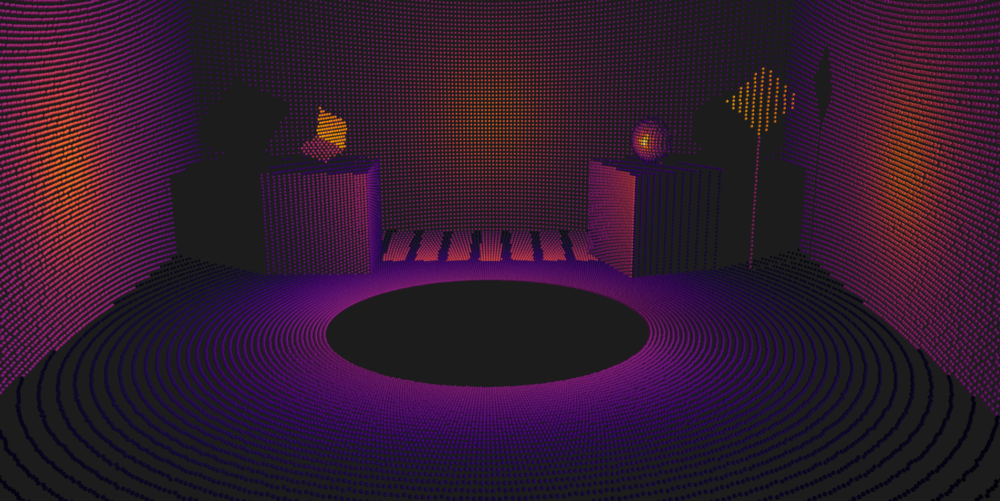

# SensorSim

Sensor simulation plug-in for our 3D engine at [DCC-Lab/PyTissueOptics](https://github.com/DCC-Lab/PyTissueOptics).

### LiDAR 
```python
from sensorsim import Sensor, scenes

scene = scenes.PhantomScene()
lidar = Sensor()

lidar.capture(scene)

lidar.display()
```


Current simulation takes into account:
- Diffuse and specular reflection (Blinn-Phong model).
- Signal noise and attenuation (basic model).
- Light beam divergence (basic model).
- Material reflectivity or retro reflectivity properties.
