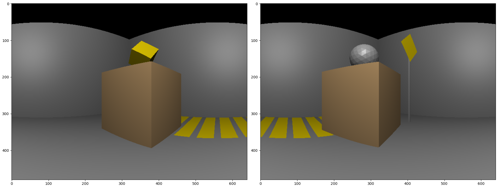
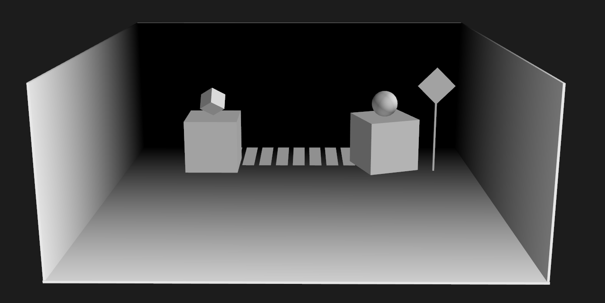

# SensorSim

Sensor simulation plug-in for our 3D engine at [DCC-Lab/PyTissueOptics](https://github.com/DCC-Lab/PyTissueOptics).

Current simulation takes into account:
- Ambient, diffuse and specular reflection (Blinn-Phong model).
- Signal noise and attenuation (basic model).
- Light beam divergence (basic model).
- Material reflectivity or retro reflectivity properties.

Coming up:
- A more complex RoadScene
- Addition of RaDAR sensors
- Improved sensor models


## Example
Using the default AV sensor suite composed of one 360 LiDAR and 2 cameras, and capturing the default phantom scene. 

```python
from sensorsim import AVSuite, scenes

scene = scenes.PhantomScene()
scene.display()

sensors = AVSuite()
sensors.capture(scene)
sensors.display()
```

### LiDAR


### Camera


## Scenes
Available scenes to scan. 
### PhantomScene

